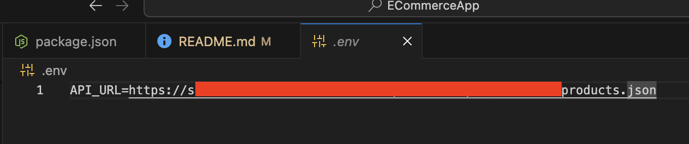
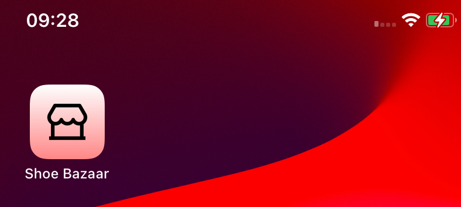
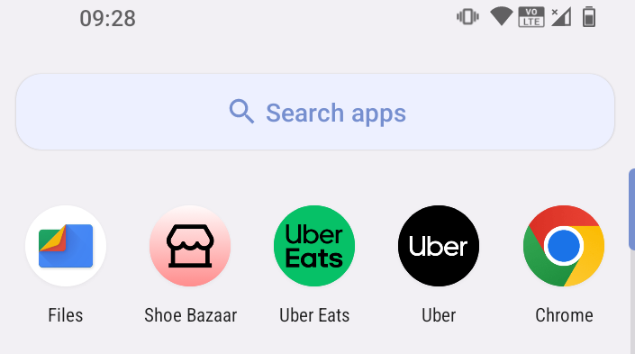
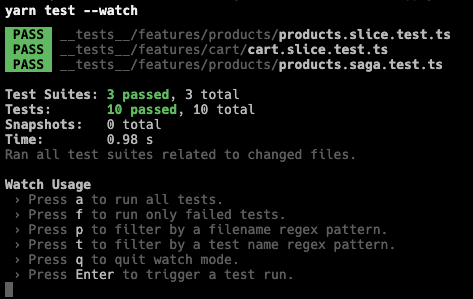
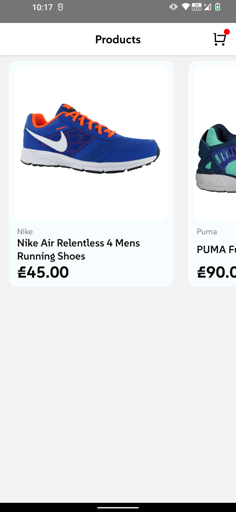

# Shoe Bazaar (Coding Assignment)

# Prerequisites
You must follow the steps given in the [official documentation](https://reactnative.dev/docs/set-up-your-environment).

## Environments

- `Java openjdk 11.0.24 2024-07-16`
- `XCode 15.4`
- `Android Studio Koala | 2024.1.1`

## Used Devices
- `Nokia 5 4 - Android 12 (API 31)`
- `iPhone XR - iOS 17.6.1`

## Setup Instructions

1. Install ([Node Version Manager](https://github.com/nvm-sh/nvm)) `nvm` in your local machine.
2. Clone the repository from [Github](https://github.com/akmalahmed525/ECommerceApp).
3. Navigate to the repository and run the command below.
   ```sh
   nvm use .
   ```
4. Install the packages via the command below.
   ```sh
   yarn
   ```
5. Create a `.env` file from `.env.example` file and add the API url
   ```sh
   cp .env.example .env
   ```
6. Point your server URL to the `API_URL` property in the `.env` file.
   ```env
   API_URL=https://..../products.json
   ```
   
7. Open a new terminal in the same directory and run either of the command below to install the development version of the application in your device.
   ```sh
   yarn android # for Android devices
   yarn ios # for iOS devices
   ```
8. Your App will be installed  
   
   iOS
   ---
   

   Android
   ---
   

9. To run the test cases, run the command below (written only for `Redux` and `Redux Saga` functions due to time constraints).
   ```sh
   yarn test --watch
   ```

   

10. Screen Recording of `iOS` and `Android`.  
  
   [](https://youtu.be/ES4fyLz_Cko)

   [](https://youtu.be/jO0wkjApItw)
